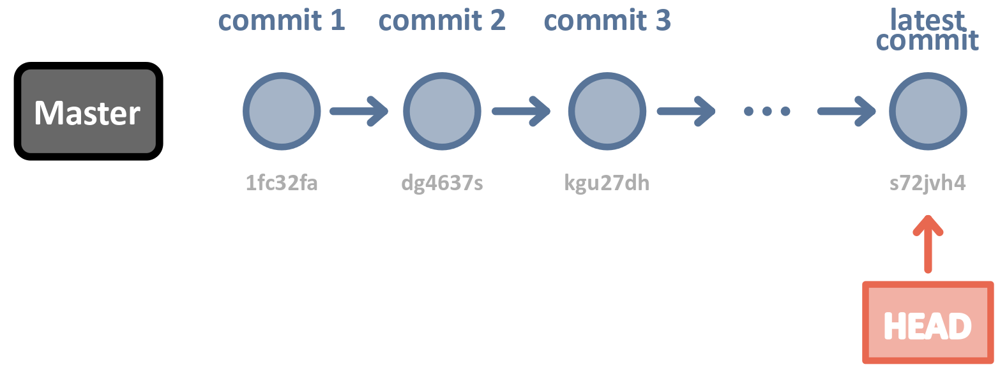
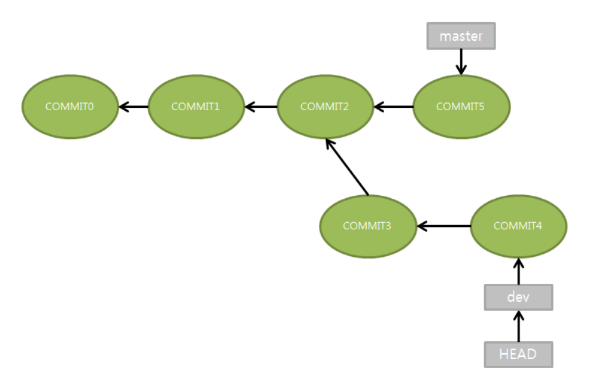
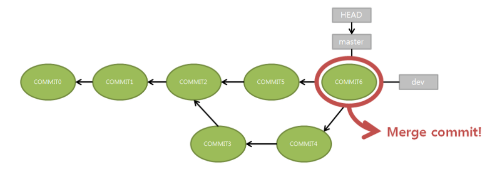

# Part 0. git

---

# Question

- 버전 관리 시스템은 왜 필요한가요?
- git 외의 버전관리 시스템에는 무엇이 있나요? git은 그 시스템과 어떤 점이 다르며, 어떤 장점을 가지고 있나요?
- git의 `clone`/`add`/`commit`/`push`/`pull`/`branch`/`stash` 명령은 무엇이며 어떨 때 이용하나요? 그리고 어떻게 사용하나요?

# Answers

- 버전 관리 시스템은 왜 필요한가요?

## 버전 관리 시스템

파일  변화를 시간에 따라 기록 했다가 이후의 특정 시점의 버전을 다시 꺼내올 수 있는 시스템 입니다.

동일한 정보에 대한 여러 버전을 관리하게 되며,  버전을 통해 시간적으로 변경 사항과 변경 사항에 대한 작업자를 추적할 수 있습니다.

### 왜 필요한가?

버전관리 시스템을 사용하면 아래와 같은 장점을 얻을 수 있습니다.

1. 변경점 관리 : 어떤 내용을 누가 작성해서 어느 시점에 들어갔는지 확인할 수 있습니다.
2. 버전 관리 : 특정 시점에 꼬리표(Tag)를 달아 버전을 표시해주고 , 브렌치(Branch) 등으로  동시에 여러 버전을 개발할 수 있게 해줍니다.
3. 백업 및 복구 : 무언가가 잘못되었을때 다시 특정시점으로 돌아가게(RollBack)할 수 있고, 사고로 인해 내용이 날아간 경우에도 복구할 수 있게 해줍니다.
4. 협업 : 같이 일하는 사람(팀원 등)에게 수정사항 등을 쉽게 공유할 수 있습니다.

---

- git 외의 버전관리 시스템에는 무엇이 있나요?

## 버전 관리 시스템의 종류

### Team Foundation Version Control - Microsoft

Team Foundation Version Control(이하 TFVC)는 소스 코드 관리 및 보고, 요구 사항 관리, 프로젝트 관리(애자일 모델, 폭포수 모델 등) 요구 사항 관리부터 테스팅 및 출시 관리 기능까지 제공하는 툴입니다.

Git과 비교했을 때, Git은 분산 버전 제어 시스템인 것과 다르게 TFVC는 중앙 집중형이라는 특징이 있습니다.

### Subversion

여러명이서 작업하는 프로젝트의 버전관리나 각자 만든 소스의 통합과 같은 문제를 해결하기 위해 저장소를 만들어 그곳에 소스를 저장해 소스 중복이나 여러 문제를 해결하기 위한 형상관리/소스 관리 툴입니다.

SVN도 TFVC와 마찬가지로 중앙 집중형 구조를 가진 버전 관리 시스템입니다.

---

- git의 `clone`/`add`/`commit`/`push`/`pull`/`branch`/`stash` 명령은 무엇이며 어떨 때 이용하나요? 그리고 어떻게 사용하나요?

## Git Command

### clone

기존 프로젝트에 참여하거나, Git저장소를 복사하고 싶을 때 사용합니다.

> git clone [저장소 주소]

### add

파일의 변경사항을 추적하고 스테이징항목에 올려놓을 때 사용합니다.

> git add [add 옵션]

### commit

스테이징 항목에 올라와 있는 파일을 커밋할 때 사용합니다. 커밋을 하면 로컬공간에 저장됩니다.

> git commit [Commit 옵션]

### push

로컬공간에 저장된 커밋을 Git Repository에 반영합니다.

> git push [push 옵션]

### pull

원격 저장소에 변경된 데이터를 가져올 때 사용합니다.

> git pull [pull 옵션]

### branch

현재 브렌치를 확인하거나, 브렌치를 생성 및 삭제할 때 사용합니다. 

> git branch [branch 옵션]

### stash

아직 마무리하지 않은 작업을 스택에 잠시 저장해 둘 때 사용합니다.  add 를 이용하면 이 스택에 저장됩니다.

> git stash [stash 옵션]

# 보완 내용

- 커밋이 어떻게 되어 있는지?

## 커밋의 구조

커밋은 로컬 저장소에 올리는 하나의 변경된 상태입니다. 하나의 커밋이 더해질 때는 이전 커밋에서 변경된 사항만 추가하면 됩니다.

커밋을 다른 식으로 표현하면 작업했을 당시를 **스냅샷** 이라고도 표현합니다.

위 그림과 같이 체이닝 구조로 이루어져 있는데, 이는 이전 커밋에서 문제가 발생하면 그 이후 커밋도 망가지게 됩니다.

커밋을 하게 되면 커밋된 내용이 **객체화 되어서** .git/object 폴더에 저장됩니다. 이 커밋 객체의 구성요소는 아래와 같습니다.

- Tree
- Parent
- 작성자 정보
- commit 내용

여기서 중요한 것은 **Tree**와 **Parent** 입니다.

Tree는 커밋했을 당시 작업 공간에 있던 파일들의 내용(해당 Object 디렉토리 정보)을 가지고 있습니다.

Parent는 이전 버전의 커밋 객체 디렉토리를 가리키고 있습니다. 최초 커밋시에는 여기에 정보가 존재하지 않습니다. 

이렇게 Parent와 Tree를 이용하여 **체이닝 구조**가 성립됩니다.

Object File은 크게 세가지로 나뉩니다.

- blob : 파일의 내용을 담고 있습니다.
- tree : 파일명과 그 파일명의 내용에 해당하는 blob의 정보를 가지고 있습니다.

- commit : object ID를 가지고 있습니다.

## Merge와 Rebase

먼저 Merge에 대해 기술 하겠습니다.

### Merge

아래 상황은 Dev 브렌치가 master브렌치에서 분기한 후에 2개의 commit을 했습니다. 그런데 master브렌치에서도 Dev브렌치가 분기한 후에 하나의 커밋을 더 했습니다.

이러한 상황에서 Merge를 하려면 Merge Commit 을 하나 더만들어서 아래처럼 병합해야 합니다.

위 그림처럼 Merge Commit Object가 생성되어 병합됩니다.

### Rebase

Rebase는 dev Branch의 root  Commit의 위치를 commit2에서 commit5로 바꾸어서 자연스럽게 연결 되어지게 만들어주는 것입니다.

## Merge와 Rebase의 차이점은?

> Merge는 Branch를 통합하는 것, Rebase는 Branch의 Base를 옮기는 것입니다

하지만 Master에서 rebase를 하는 것은 되도록 피하는 것이 좋습니다. rebase를 하게 되면 커밋도 새로 쓰고 정렬도 해야하기 때문에 기존에 커밋 트리가 완전히 달라집니다.

- 같은 커밋 메세지여도 rebase전에 커밋로그와 후의 커밋로그의 해쉬 값이 완전히 달라짐에 주의해야 합니다.
- dev브렌치의 커밋 로그가 master 커밋 트리 중간에 불쑥 들어온 것을 확인해 보아야 합니다.

즉, 리베이스 전에 master에서 분기했던 브렌치를 (커밋트리가 달라진)  master에 병합할 경우 무수히 많은 충들과 직면하게 됩니다.