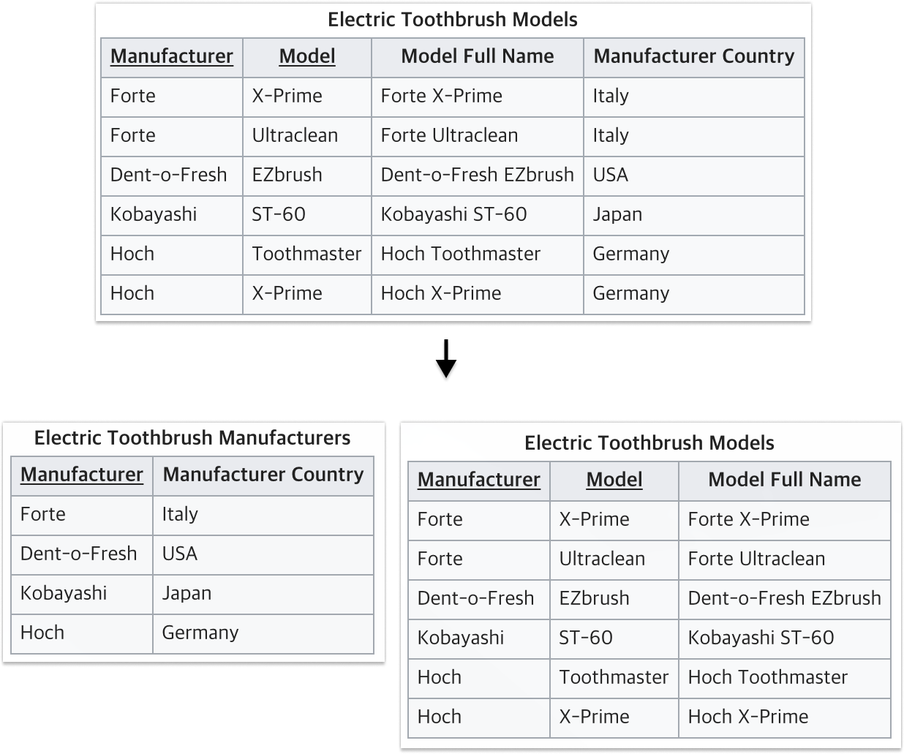

# Quest 11. RDB의 기초와 ORM

## Introduction
* 이번 퀘스트에서는 데이터베이스를 다루는 방법에 대해 알아보겠습니다.

## Topics
* RDBMS
* MySQL
* ORM
* Hash
  * [scrypt](https://en.wikipedia.org/wiki/Scrypt)

## Resources
* [MySQL 101 – The basics](https://www.globo.tech/learning-center/mysql-101-basics/)
* [Sequelize](https://sequelize.org/)
* [안전한 패스워드 저장](https://d2.naver.com/helloworld/318732)

## Checklist
### RDBMS 테이블의 정규화는 무엇인가요?

- 중복을 최소화하게 데이터를 구조화하는 프로세스를 정규화(Normalization)
- 제대로 조직되지 않은 테이블들과 관계들을 작고 잘 조직된 테이블과 관계들로 나누는 것을 포함
- 기본 목표는 테이블 간에 중복된 데이타를 허용하지 않는다는 것
- 무결성(Integrity)를 유지할 수 있으며, DB의 저장 용량 역시 줄일 수 있음
- 정규화는 1정규화 ~ 6정규화 까지 있지만, 실무에서는 대체로 1~3 정규화까지의 과정을 거침

**[ 제 1정규화 ]**

1. 어떤 Relation에 속한 모든 Domain이 원자값(atomic value)만으로 되어 있다.
2. 모든 attribute에 반복되는 그룹(repeating group)이 나타나지 않는다.
3. 기본 키를 사용하여 관련 데이터의 각 집합을 고유하게 식별할 수 있어야 한다.

**[ 제 2정규화 ]**

모든 컬럼이 완전 함수적 종속을 만족 해야한다.

- 함수적 종속: X의 값에 따라 Y값이 결정될 때 X -> Y로 표현하는데, 이를 Y는 X에 대해 **함수적 종속** 이라고 한다. 예를 들어 학번을 알면 이름을 알 수 있는데, 이 경우엔 학번이 X가 되고 이름이 Y가 된다. X를 결정자이라고 하고, Y는 종속자라고 한다. 다른 말로 X가 바뀌었을 경우 Y가 바뀌어야만 한다는 것을 의미한다.
- 함수적 종속에서 X의 값이 여러 요소일 경우, 즉, {X1, X2} -> Y일 경우, X1와 X2가 Y의 값을 결정할 때 이를 **완전 함수적 종속** 이라고 하고, X1, X2 중 하나만 Y의 값을 결정할 때 이를 **부분 함수적 종속** 이라고 한다.

**[ 제 3정규화 ]**

기본 키(primary key)가 아닌 속성(Attribute)들은 기본 키에만 의존해야 한다.

---

### MySQL 외의 RDB에는 어떤 것들이 있나요?

- ORACLE
- Maria DB
- PostgreSQL
- Microsoft SQL Server
- SQLite
- AWS, GCP, AZURE의 DB서비스
- 등등

---

### Relational Database 외에 다른 DB에는 어떤 것들이 있을까요?

**NoSQL**

- NoSQL의 장점
  - 대용량 데이터
  - 데이터 분산 처리
  - Cloud Computing
  - 빠른 읽기/쓰기 속도
  - 유연한 데이터 모델링
- NoSQL의 종류
  - key / value
    - 휘발성/영속성
    - Memchached, Tokyo Tyrant, Flare, Roma, Redis
  - Document
    - 스키마 정의 없음
    - MongoDB, CouchDB
  - Big Table(Column 형) DB
    - 뛰어난 확장성, 검색에 유리
    - Hbase, Casandara, Hypertable

---

### RDBMS에서 테이블의 인덱싱은 무엇인가요? 인덱싱을 하면 어떤 점이 다르며, 어떤 식으로 동작하나요?

- 인덱싱?
  - 데이터베이스의 조회는 테이블 전체를 탐색해서 조회한다. 데이터가 늘어날 수록 성능이 떨어질 수 밖에 없다.
  - 자주 사용하는 칼럼에 대한 인덱스 테이블이 존재하여 조건(칼럼)에 해당하는 데이터들만 바로 조회 가능 하다면 성능을 올릴 수 있다.
  - 즉, 추가적인 Write 작업 & 저장 공간(인덱스테이블)을 활용하여 검색 범위를 줄이고 검색 속도를 향상 시킬 수 있다.
- 장점
  - 테이블을 조회하는 퍼포먼스를 향상 시킬 수 있음
- 단점
  - 추가적인 쓰기 작업과 인덱스 테이블을 위한 저장공간이 필요
  - 조회보다 생성 작업이 많을 경우 효울이 떨어짐
  - 잘못 사용할 경우 오히려 퍼포먼스 악영향
  - 인덱스를 관리하는 작업이 필요
- 동작
  - 특정 칼럼을 인덱싱 하여 인덱스 테이블 생성
  - 인덱스를 사용하지 않으면 특정 조건에 맞는 조회시 풀스캔 하여야함
  - 인덱스를 사용하면 SELECT 쿼리로 해당 칼럼을 사용시 해당 테이블 전체를 풀스캔 하는게 아니라
  - 특정 알고리즘(보통 B-Tree, B+Tree) 으로 생성되어있는 인덱스 테이블을 활용해 검색 범위를 줄여 조회

---

### ORM을 사용하는 것은 사용하지 않는 것에 비해 어떤 장단점을 가지고 있나요?

- 장점
  - SQL문이 아닌 익숙한 코드로 웬만한 DB조작이 가능
  - 객체를 통해 데이터를 접근,수정 하기때문에 코드 가독성 및 유지보수 장점
  - DBMS 종속성 하락
- 단점
  - 복잡한 쿼리의 경우 ORM으로 처리하기 힘들거나 난이도가 상승
  - DBMS의 모든 기능을 사용할 수 없음
  - 목적에 맞게 잘 짜여진 쿼리 보다 대부분 성능이 좋지 못함 (호출 방식에 따라 성능 천차만별)

---

### 자바스크립트 생태계의 ORM에는 어떤 것들이 있나요?

- Sequelize
- TypeORM
- Prisma
- Bookshelf
- Mongoose

---

### 모델간의 1:1, 1:N, N:M 관계는 각각 무엇이고 어떨 때 사용하나요?

- 1:1
  - A의 한 요소가 B의 한 요소에만 연결될 수 있는 관계
  - 유저 id - 유저 이메일
- 1:N
  - A의 한 요소가 B의 여러 요소에 연결될 수 있는 관계
  - 게시물 - 댓글
- N:M
  - A의 한 요소가 B 의 여러 요소에 연결될 수 있고, B의 한 요소가 A의 여러 요소에 연결 될 수 있는 관계
  - 학생 - 수업

---

### DB에 사용자의 암호를 평문으로 저장하지 않고도 사용자의 암호를 인증하는 것이 가능한 이유는 무엇일까요?

단방향 알고리즘(해쉬)으로 암호화를 하여 저장하기 때문에 복호화가 (거의) 불가능. 따라서 평문을 해싱 한 값이 일치한지를 검사하여 올바른 암호인지 확인이 가능합니다.

---

### 해시 함수에는 어떤 것이 있나요?

- MD - MD5
- SHA
- HAS-180
- MAC - NestedMAC, HMAC, CMAC
- 등등

---

### 사용자의 암호를 해싱하여 저장할 때 어떤 식으로 저장하는 것이 보안에 좋을까요?

레인보우 테이블

- 솔팅 - 솔트값을 추가하여 해싱
- 키 스트레칭 - 여러번 해싱
- Adaptive Key Derivation Functions - 솔트와 패스워드 외에도 입력 값을 추가하여 공격자가 쉽게 다이제스트를 유추할 수 없도록

---

## Advanced

### Object–relational impedance mismatch란 어떤 개념인가요?

- 객체 모델을 관계형 모델에 저장할 때 발생하는 문제, 계형 모델과 메모리 내 데이터 구조 간 차이
- 세분성
  - 객체 모델에서는 여러개의 클래스가 하나의 객체 모델을 이룰 수 있지만 관계형의 테이블은 하나 인것처럼 불일치가 발생
- 상속
  - 관계형 에서는 상속이란 개념이 없음
- 동일성
  - 관계형은 동일성을 보장하는 PK를 제공하지만 객체 모델은 동일성, 동등성 모두 정의
- 연관성
  - 객체지향 언어에서는 연관관계가 단방향 참조로만 이루어짐
- 데이터 탐색
  - 객체는 하나의 객체에서 출발해 연결되는 다른 객체를 그래프 방식으로 탐색 하지만 관계형 데이터 베이스에서는 비효율적. 관계형

---

### Foreign Key란 무엇인가요? 이것을 사용할 때의 장점과 단점은 무엇일까요?

- Foreign Key?
  - 관계를 맺고 있는 다른 테이블의 기본키를 참조하는 키
- 장점
  - 데이터의 참조무결성 보장
- 단점
  - 설계가 완벽하지 않아 요구사항이 바뀌거나 구조가 바뀔때 까다로움
  - 개발 단계에서 유연하지 못해서 생기는 cost
  - 따라서 ERD 상에는 존재하지만 스키마에는 존재하지 않고 로직으로 처리
## Quest
* 이번에는 메모장을 파일이 아닌 DB기반으로 만들어 보고자 합니다.
  * 적절한 테이블을 설계해 보세요.
  * Sequelize를 이용하여 데이터의 모델을 만들고 어플리케이션에 적용해 보세요.
  * 사용자의 비밀번호는 해싱을 통해 저장되어야 합니다.

## Advanced
### Object–relational impedance mismatch란 어떤 개념인가요?

- 객체 모델을 관계형 모델에 저장할 때 발생하는 문제, 계형 모델과 메모리 내 데이터 구조 간 차이
- 세분성
  - 객체 모델에서는 여러개의 클래스가 하나의 객체 모델을 이룰 수 있지만 관계형의 테이블은 하나 인것처럼 불일치가 발생
- 상속
  - 관계형 에서는 상속이란 개념이 없음
- 동일성
  - 관계형은 동일성을 보장하는 PK를 제공하지만 객체 모델은 동일성, 동등성 모두 정의
- 연관성
  - 객체지향 언어에서는 연관관계가 단방향 참조로만 이루어짐
- 데이터 탐색
  - 객체는 하나의 객체에서 출발해 연결되는 다른 객체를 그래프 방식으로 탐색 하지만 관계형 데이터 베이스에서는 비효율적. 관계형

---

### Foreign Key란 무엇인가요? 이것을 사용할 때의 장점과 단점은 무엇일까요?

- Foreign Key?
  - 관계를 맺고 있는 다른 테이블의 기본키를 참조하는 키
- 장점
  - 데이터의 참조무결성 보장
- 단점
  - 설계가 완벽하지 않아 요구사항이 바뀌거나 구조가 바뀔때 까다로움
  - 개발 단계에서 유연하지 못해서 생기는 cost
  - 따라서 ERD 상에는 존재하지만 스키마에는 존재하지 않고 로직으로 처리
